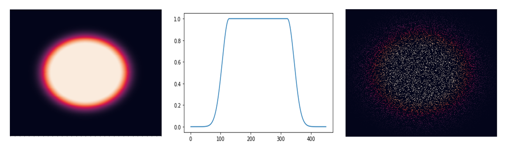
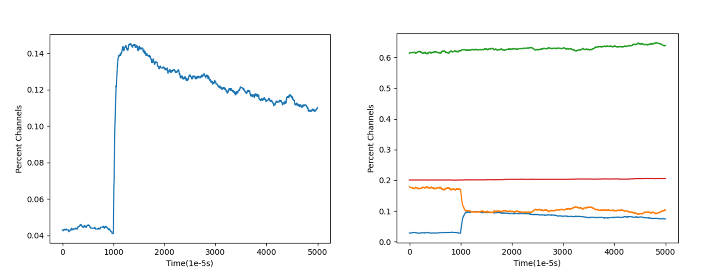

# **Description**
This package is meant to simulate piezo1 channel kinetics in a membrane in the presence of tension *in silico*. Based on various parameters, such as membrane tension, tension diffusion, channel P50, etc., this package will allow you to determine the delay in maximum elicited current post stimulus onset.  Other readout from this package includes maximum current and percent occupancy of channels in each state.

# **Examples**
Generate tension profiles based on rate of tension diffusion and tension-clamped stimuli size. Tension profiles will be calculated only for pixels where a channel is located to reduce computation time.

***Fig 1:*** *Left: tension profile for all pixels with a given tension-clamped stimuli and rate of diffusion. Middle: tension values after normalization through the center of the tension profile. Right: Tension profile when only the pixels where channels are located are calculated.*

Generate state occupancy plots to show the percentage of channels that are in either the closed, open, inactive, or slow inactive state.

***Fig 2:*** *Left: Percentage of channels in the open state upon a stimulus onset at time = 1000 * 10^-5. Right: Percentage of channels occupying each state (blue = open, orange = closed, green = inactive, red = slow inactive).*

# **Getting Started**

## Dependencies
- Python ^3.9 (other versions not guaranteed)
## Installing
- git clone https://github.com/msindoni/piezo_markov_simulation.git
- •conda env create -f requirements.txt
# **Executing Program**
### Variables/Inputs
- tension : the tension, in mN/m, that is applied to the tension-clamped stimulus area
- xsize : size of the membrane, in piexls, in the horizontal direction. Each pixel is 10nm x 10nm
- ysize : size of the membrane, in piexls, in the vertical direction. Each pixel is 10nm x 10nm
- fps : How many iterations are run per second. To prevent oscillations, needs to be at minimum 10^5 for tensions 1-5mN/m, 10^6 for tension 6-7Mn/N, and 1/10^7 for tension 8mN/m
- diffusion_coeff_list : list of diffusion coefficients to be tested in terms of pixels/s

### Other Details
 - Number of trials per diffusion coefficient is durrently set to 20 but this can be changed in line 380
 - Tension-clamped radius is set at 200 pixels but can be changed in line 389 by changing the value for the variable poke_size
 - As written, a channel state plot will be produced every trial. To run all tensions and trials without interruption, inactivate lines 432-438.

# **Authors**
- Michael Sindoni msindoni22@gmail.com
- Michael Young neuromyoung@gmail.com

# **License**
This project is licensed under the MIT License - see the LICENSE file for details
